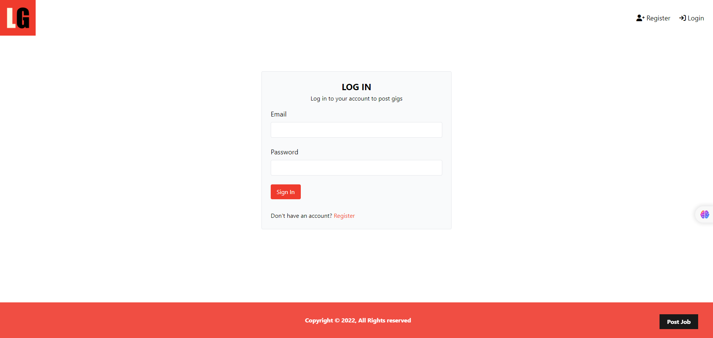

# About the project 

The project is building a job listing application using Laravel 10 and MySQL. The application allows users to create, view, update, and delete job listings. Users can sign up, log in, and manage their job listings. The project covers essential Laravel concepts such as routing, models, views, controllers, authentication, relationships, and CRUD functionality. By completing this project, you will gain practical experience in building a web application with Laravel and MySQL.

## About Laravel

Laravel is a web application framework with expressive, elegant syntax. We believe development must be an enjoyable and creative experience to be truly fulfilling. Laravel takes the pain out of development by easing common tasks used in many web projects, such as:

- [Simple, fast routing engine](https://laravel.com/docs/routing).
- [Powerful dependency injection container](https://laravel.com/docs/container).
- Multiple back-ends for [session](https://laravel.com/docs/session) and [cache](https://laravel.com/docs/cache) storage.
- Expressive, intuitive [database ORM](https://laravel.com/docs/eloquent).
- Database agnostic [schema migrations](https://laravel.com/docs/migrations).
- [Robust background job processing](https://laravel.com/docs/queues).
- [Real-time event broadcasting](https://laravel.com/docs/broadcasting).

Laravel is accessible, powerful, and provides tools required for large, robust applications.

## Outputs

## Thanks

 - [Traversy Media](https://youtu.be/MYyJ4PuL4pY?si=llJv7PcgNLJrEuq3)
 - [Laravel From Scratch | 4+ Hour Course](https://youtu.be/MYyJ4PuL4pY?si=llJv7PcgNLJrEuq3)

